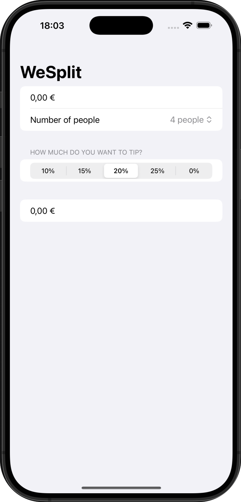

# WeSplit

Aplicación para compartir una pago según la cantidad de personas y la cantidad de propina que se desee dejar.

## 🚀 Funcionalidades
➡️ Podremos añadir el importe total, el número de personas entre las que repartir el pago y el porcentaje de propina que queremos pagar, este último con 5 valores fijos.
En el último apartado nos arrojará el importe total a pagar cada usuario

    

