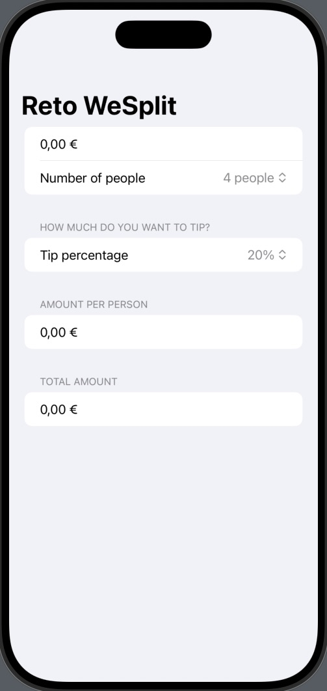

# WeSplit

Aplicación para compartir una pago según la cantidad de personas y la cantidad de propina que se desee dejar.

## 📱 Funcionalidades
➡️ Podremos añadir el importe total, el número de personas entre las que repartir el pago y el porcentaje de propina que queremos pagar, este último con 5 valores fijos.
En el último apartado nos arrojará el importe total a pagar cada usuario

    

## 🎯 Reto
➡️ En cada uno de las mini aplicaciones de este programa hay unos retos adidionales para que la persona que lo esté realizando amplíe un poco el contenido de la misma.  

✏️ Las modificaciones en este caso son las siguientes:  

1️⃣ Añadir un título a la sección 3 llamada "Amount per person".  
2️⃣ Añadir otra sección que muestre el pago total, incluyendo la propina.  
3️⃣ Cambiar las opciones de la propina y establecer del 0 al 100% en vez de las 5 predefinidas.  

Y el resultado: ⬇️

    

## 📌 Créditos
‼️ Este proyecto es parte del programa [100 días de SwiftUI](https://www.hackingwithswift.com/100/swiftui) de Paul Hudson, en la plataforma [Hacking with Swift](https://www.hackingwithswift.com) ‼️