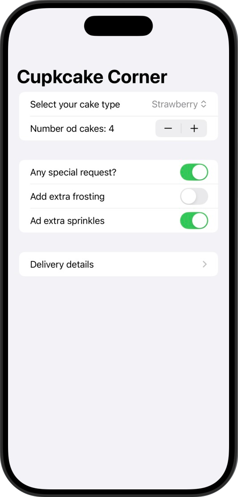
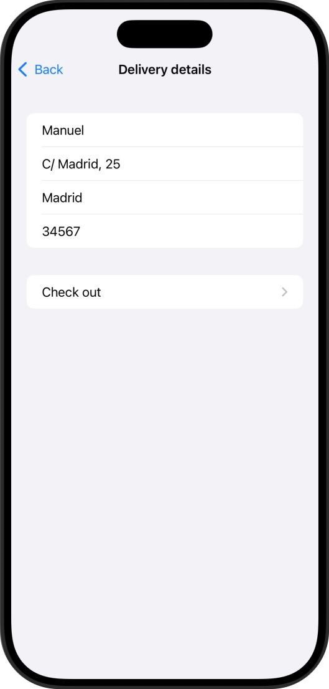
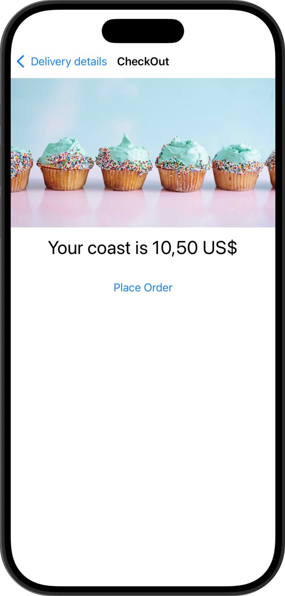
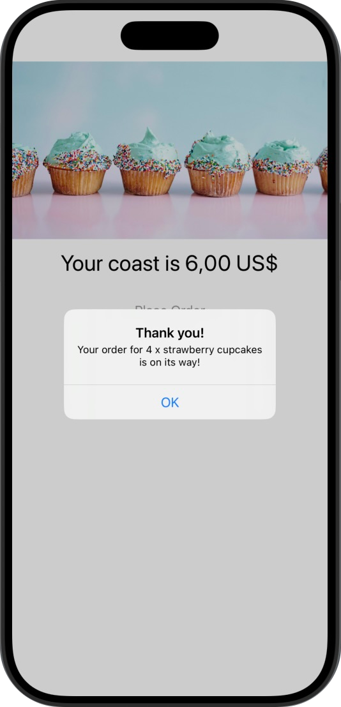
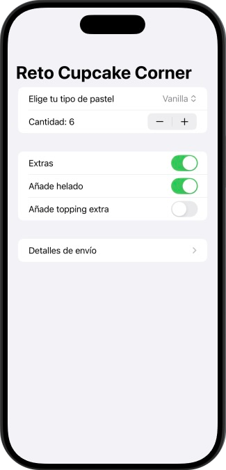
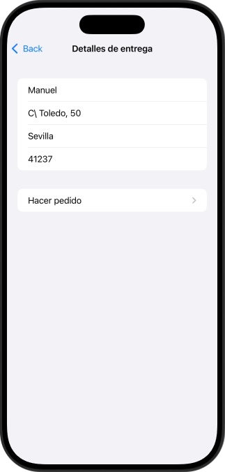
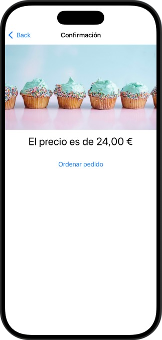
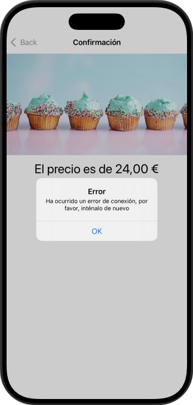

# CupcakeCorner

Aplicación que que simula pedidos de cupcakes para poder aprender a enviar y recibir datos a través de internet y profundizar un poco más en la persistencia de datos.  

## 📱 Funcionalidades
➡️ La app permite "comprar pastelitos" a domicilio:  
1. El usuario podrá elegir el sabor entre vanilla, fresa, chocolate o arcoíris.  
2. Se podrá elegir simple, o con extras.  
3. Si se elige con extras, podrás añadir helado y topping

  
  &nbsp;&nbsp;&nbsp;&nbsp;&nbsp;&nbsp;&nbsp;&nbsp;&nbsp;
    

  
  &nbsp;&nbsp;&nbsp;&nbsp;&nbsp;&nbsp;&nbsp;&nbsp;&nbsp;
  

## 🎯 Reto
➡️ En cada uno de las mini aplicaciones de este programa hay unos retos adidionales para que la persona que lo esté realizando amplíe un poco el contenido de la misma.  

✏️ Las modificaciones en este caso son las siguientes:  

1️⃣ Actualmente, nuestros campos de dirección se consideran válidos si contienen algo, incluso si solo contienen espacios. Mejora la validación para garantizar que sólo unos cuantos espacios no sean válidos.  
2️⃣ Si nuestra llamada a placeOrder() falla (por ejemplo, si no hay conexión a internet), se deberá mostrar una alerta informativa al usuario.  
3️⃣ Actualiza la clase Order para que guarde datos como la dirección de entrega del usuario en UserDefaults. Esto requiere un poco de reflexión, ya que @AppStorage no funcionará en este caso, y verás que los métodos getter y setter causan problemas con la compatibilidad con Codable.  

Y el resultado: ⬇️  

⚠️ En este caso, la última imagen muestra una alerta de error en vez de la confirmación del pedido ya que ésta última no varía, y el error es lo que se pide en el punto número 2 ⚠️  

  
  &nbsp;&nbsp;&nbsp;&nbsp;&nbsp;&nbsp;&nbsp;&nbsp;&nbsp;
    

  
  &nbsp;&nbsp;&nbsp;&nbsp;&nbsp;&nbsp;&nbsp;&nbsp;&nbsp;
  

## 📌 Créditos
‼️ Este proyecto es parte del programa [100 días de SwiftUI](https://www.hackingwithswift.com/100/swiftui) de Paul Hudson, en la plataforma [Hacking with Swift](https://www.hackingwithswift.com) ‼️