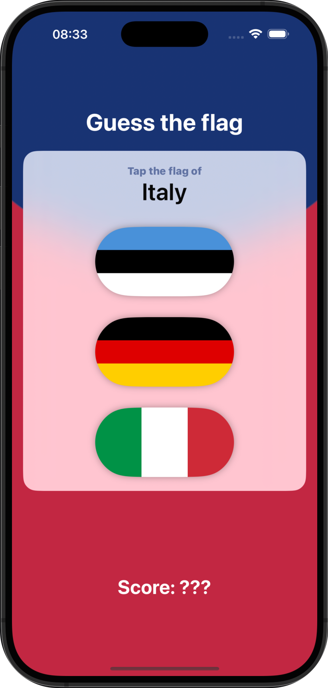

# Guess the Flag

Pequeño juego educativo para aprender y adivinar banderas de países. Diseñado para mejorar el conocimiento de geografía de manera interactiva y divertida.

## 📱 Funcionalidades
➡️ El juego muestra el nombre de un país sobre tres opciones de banderas disponible.  
El usuario deberá seleccionar la correcta. Al elegir una bandera, se mostrará un mensaje indicando si la respuesta ha sido correcta o incorrecta.

    

## 🎯 Reto
➡️ En cada uno de las mini aplicaciones de este programa hay unos retos adidionales para que la persona que lo esté realizando amplíe un poco el contenido de la misma.  

✏️ Las modificaciones en este caso son las siguientes:  

In progress... 

Y el resultado: ⬇️

In progress...

## 📌 Créditos
‼️ Este proyecto es parte del programa [100 días de SwiftUI](https://www.hackingwithswift.com/100/swiftui) de Paul Hudson, en la plataforma [Hacking with Swift](https://www.hackingwithswift.com) ‼️