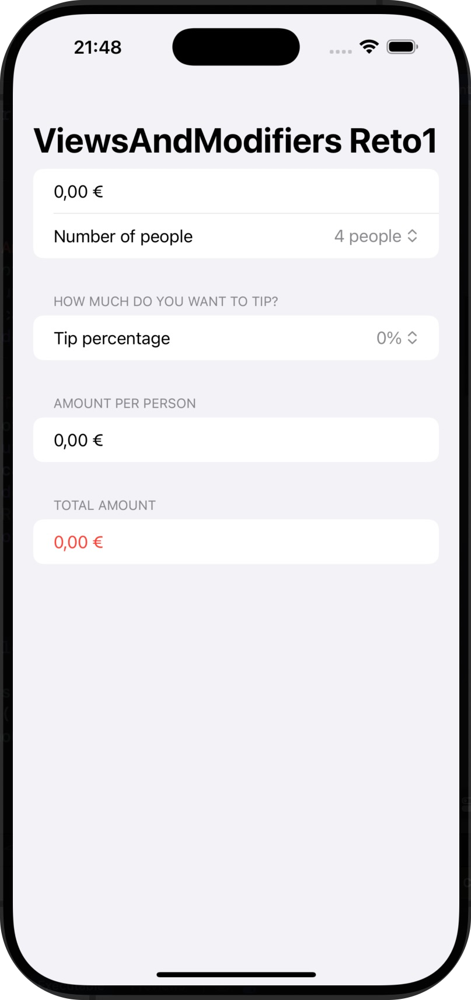
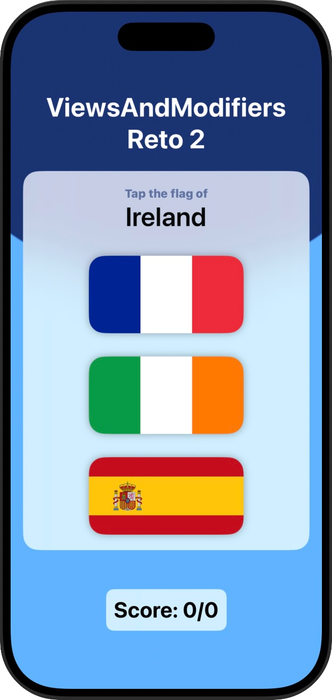
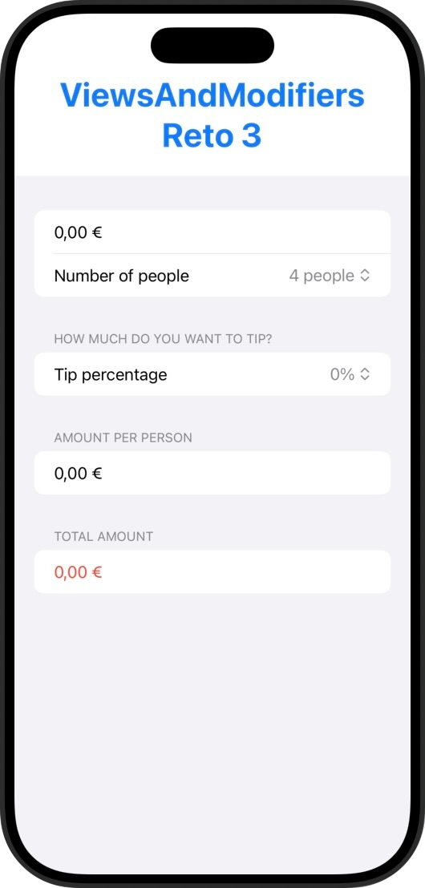

# Views and Mofidiers

Primer proyecto técnico del programa de Paul Hudson sobre dos componentes de SwiftUI: Vistas y Modificadores.

## 📱 Funcionalidades
➡️ En este caso no hay un proyecto principal, si no que se muestran una serie de explicaciones sobre vistas y modificadores para enseñarnos cómo funcionan y que posteriormente podamos realizar los retos propuestos

## 🎯 Reto
➡️ En cada uno de las mini aplicaciones de este programa hay unos retos adidionales para que la persona que lo esté realizando amplíe un poco el contenido de la misma.  

✏️ Las modificaciones en este caso son las siguientes:  

1️⃣ Volver al proyecto 1 y use un modificador condicional para cambiar la vista de texto del monto total a rojo si el usuario selecciona una propina del 0%.  
📌 **NOTA: Véase el apartado "TOTAL AMOUNT" abajo del todo.**   
2️⃣ Volver al proyecto 2 y reemplace la vista de imagen utilizada para las banderas con una nueva vista FlagImage() que renderice una imagen de bandera usando el conjunto específico de modificadores que teníamos.  
📌 **NOTA: Este reto no supone ningún cambio visual, por lo que en la imagen sólo cambia visualmente el título de la app.**   
3️⃣ Crear un ViewModifier personalizado (y la extensión View correspondiente) que haga que una vista tenga una fuente grande y azul, adecuada para títulos destacados en una vista.  
📌 **NOTA: Para este reto se usa la aplicación del proyecto 1, estableciéndole un título con dicho modificador.**   

Y el resultado: ⬇️

  
  &nbsp;&nbsp;&nbsp;&nbsp;&nbsp;&nbsp;&nbsp;&nbsp;&nbsp;
  
  &nbsp;&nbsp;&nbsp;&nbsp;&nbsp;&nbsp;&nbsp;&nbsp;&nbsp;
  
  

## 📌 Créditos
‼️ Este proyecto es parte del programa [100 días de SwiftUI](https://www.hackingwithswift.com/100/swiftui) de Paul Hudson, en la plataforma [Hacking with Swift](https://www.hackingwithswift.com) ‼️