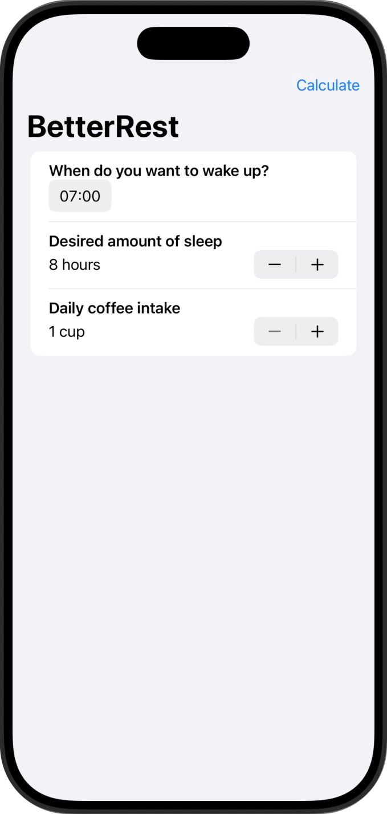
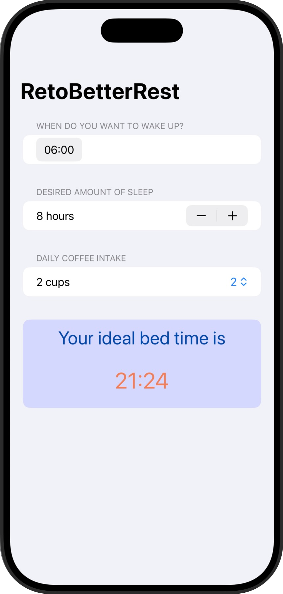

# Better Rest

☕️ Aplicación diseñada para ayudar a los amantes del café a dormir mejor, haciendo solo tres preguntas clave que veremos en las funcionalidades.  

🎯 El objetivo principal, desde el punto de vista del desarrollador, es aprender a entrenar modelos de aprendizaje automático capaces de realizar predicciones personalizadas.  

🧠 Esto es posible gracias a **Core ML**, la tecnología de Apple que permite integrar modelos de machine learning directamente en dispositivos iOS.  

💻 Los modelos se entrenan previamente en un Mac y luego se ejecutan dentro de la app, todo de forma local, garantizando así la privacidad del usuario.  

⚠️ **Advertencia** ⚠️  
Esta aplicación no tiene base médica ni científica.  
Los datos y predicciones que ofrece son únicamente de carácter demostrativo, con el propósito de mostrar el funcionamiento de modelos de aprendizaje automático integrados en una app.  
**No deben utilizarse como orientación médica ni para tomar decisiones relacionadas con la salud.**

## 📱 Funcionalidades
➡️ La app permite saber al usuario a qué hora debería ir a dormir para tener un buen descanso en función a los cafés que haya tomado en el día, haciéndote tres preguntas:  
1. ¿A qué hora quiere despertarse?
2. ¿Cuántas horas quieres dormir?  
3. ¿Cuántas tazas de café toma al día?  

    

## 🎯 Reto
➡️ En cada uno de las mini aplicaciones de este programa hay unos retos adidionales para que la persona que lo esté realizando amplíe un poco el contenido de la misma.  

✏️ Las modificaciones en este caso son las siguientes:  

1️⃣ Reemplaza cada VStack de nuestro formulario con una Sección, donde la vista de texto es el título de la sección.    
2️⃣ Reemplaca el Stepper “Número de tazas” con un Picker que muestre el mismo rango de valores.  
3️⃣ Modifiqua la interfaz de usuario para que siempre muestre la hora de dormir recomendada con una fuente grande y atractiva. Debería poder eliminar por completo el botón "Calcular".  

Y el resultado: ⬇️  

  

## 📌 Créditos
‼️ Este proyecto es parte del programa [100 días de SwiftUI](https://www.hackingwithswift.com/100/swiftui) de Paul Hudson, en la plataforma [Hacking with Swift](https://www.hackingwithswift.com) ‼️