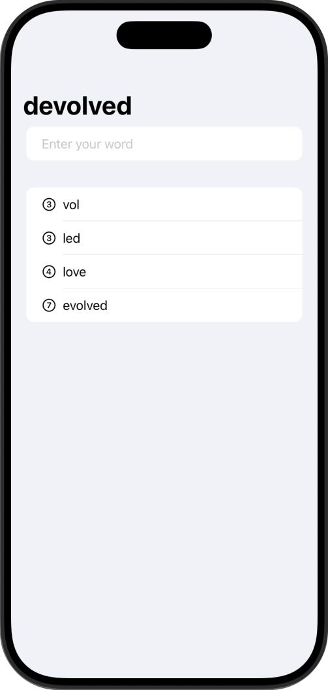
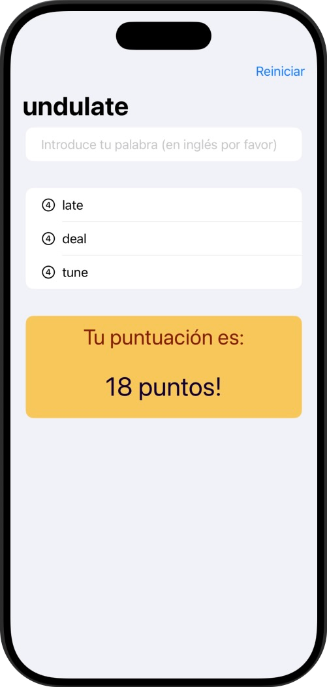

# Word Scramble

Juego de creación de palabras

## 📱 Funcionalidades
➡️ La app mostrará al usuario una palabra aleatoria de ocho letras y el usuario deberá de hacer palabras con ellas.  
🔎 Por ejemplo, si la palabra de inicio es "montaje", el usuario podrá sacar de ella las palabras "monta", "santo", "jamón"...

    

## 🎯 Reto
➡️ En cada uno de las mini aplicaciones de este programa hay unos retos adidionales para que la persona que lo esté realizando amplíe un poco el contenido de la misma.  

✏️ Las modificaciones en este caso son las siguientes:  

1️⃣ No permitas respuestas que sean más cortas de tres letras o que sean solo nuestra palabra de inicio.  
2️⃣ Agrega un botón en la barra de herramientas que llame a la función StartGame, para que los usuarios puedan reiniciar con una nueva palabra cuando lo deseen.  
3️⃣ Coloca un texto en algún lugar para que pueda mostrar la puntuación del usuario para una palabra raíz dada. La forma en que se calcula la puntuación depende de ti, pero algo que involucre el número de palabras y su recuento de letras sería razonable.  
### 📝 Sistema de puntuación elegido

El jugador obtiene **1 punto por cada letra** de las palabras válidas que introduzca, y **2 puntos adicionales por cada palabra**.

**Ejemplo:**

Si introduces las palabras `swift`, `code` y `fun`, se calcula así:

- Letras: `5 + 4 + 3 = 12 puntos`
- Palabras: `3 × 2 = 6 puntos`
- **Total: 18 puntos**

Y el resultado: ⬇️  

  

## 📌 Créditos
‼️ Este proyecto es parte del programa [100 días de SwiftUI](https://www.hackingwithswift.com/100/swiftui) de Paul Hudson, en la plataforma [Hacking with Swift](https://www.hackingwithswift.com) ‼️