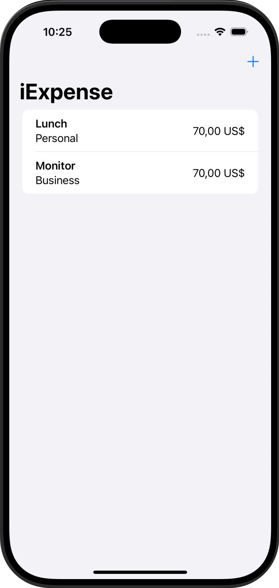
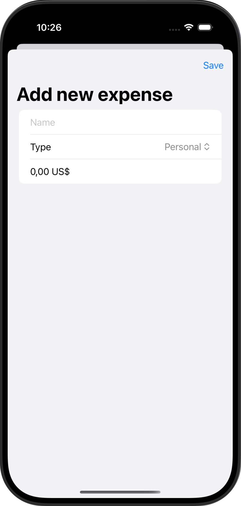
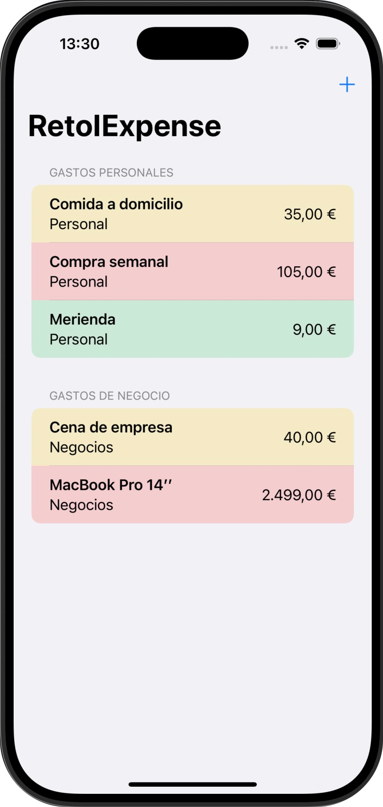
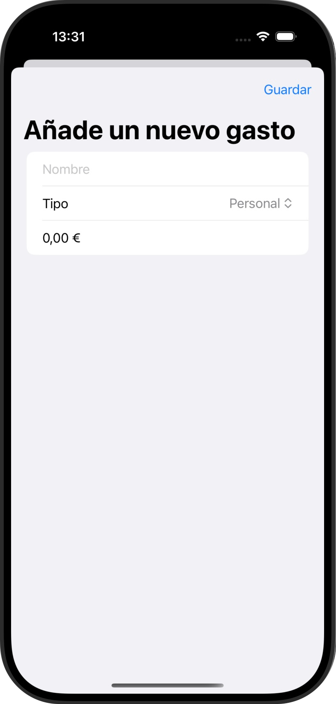
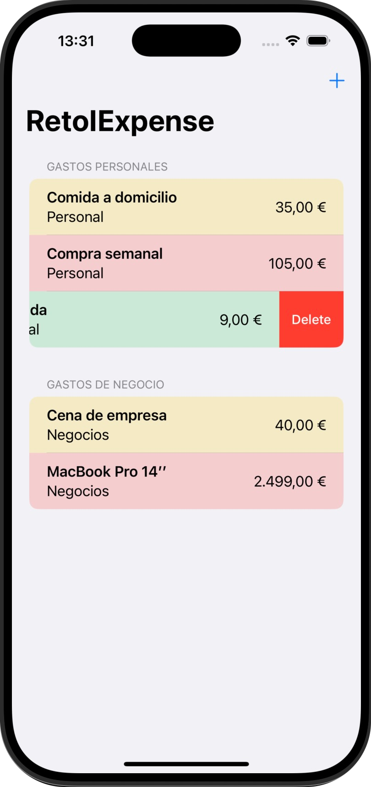

# iExpense

Aplicación que nos permite realizar un seguimiento de nuestros gastos, separando gastos personales de gastos de negocio.  
La idea de este miniproyecto es introducirnos y aprender la persistencia de datos a través de UserDefault y Codable.

## 📱 Funcionalidades
➡️ El usuario podrá añadir un gasto indicando el Nombre, el tipo (si es personal o de negocio) y el costo.  
Estos gastos serán añadidos a una lista que se visualizará en la pantalla principal.

  
  &nbsp;&nbsp;&nbsp;&nbsp;&nbsp;&nbsp;&nbsp;&nbsp;&nbsp;
  
  

## 🎯 Reto
➡️ En cada uno de las mini aplicaciones de este programa hay unos retos adidionales para que la persona que lo esté realizando amplíe un poco el contenido de la misma.  

✏️ Las modificaciones en este caso son las siguientes:  

1️⃣ Usar la moneda preferida del usuario, en lugar de usar siempre dólares estadounidenses.  
2️⃣ Modificar los importes de gastos para que incluyan estilos según su valor: los gastos inferiores a 10€ deben tener un estilo, los inferiores a 100€ otro y los superiores a 100€ un tercer estilo.  
3️⃣ Dividir la lista de gastos en dos secciones: una para gastos personales y otra para gastos de empresa.  

Y el resultado: ⬇️  

  
  &nbsp;&nbsp;&nbsp;&nbsp;&nbsp;&nbsp;&nbsp;&nbsp;&nbsp;
  
   &nbsp;&nbsp;&nbsp;&nbsp;&nbsp;&nbsp;&nbsp;&nbsp;&nbsp;
  
  

## 📌 Créditos
‼️ Este proyecto es parte del programa [100 días de SwiftUI](https://www.hackingwithswift.com/100/swiftui) de Paul Hudson, en la plataforma [Hacking with Swift](https://www.hackingwithswift.com) ‼️