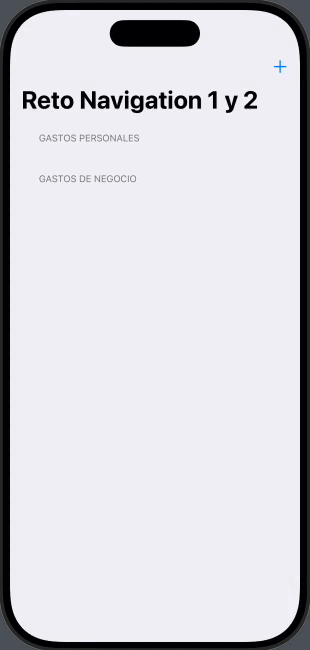

# Navigation

Ejercicio para aprender más sobre cómo cambiar de vistas con NavigationStack, NavigationLink y NavigationPath.  

## 📱 Funcionalidades
➡️ Nos encontramos con dos aplicaciones ya vistas anteriormente en este repositorio, iExpense y MoonShot.  

## 🎯 Reto
➡️ En cada uno de las mini aplicaciones de este programa hay unos retos adidionales para que la persona que lo esté realizando amplíe un poco el contenido de la misma.  

✏️ Las modificaciones en este caso son las siguientes:  

1️⃣ Modifica el proyecto 7 (iExpense) para que use NavigationLink para agregar nuevos gastos en lugar de una sheet. (Consejo: El código dismiss() funciona bien aquí, pero podría ser útil agregar el modificador navigationBarBackButtonHidden() para que tengan que seleccionar explícitamente Cancelar).  
2️⃣ Intenta modificar el proyecto 7 (iExpense) para que permita a los usuarios editar el nombre de su gasto en el título de navegación, en lugar de en un campo de texto aparte.  
3️⃣ Vuelve al proyecto 8 (Moonshot) y actualízalo para usar NavigationLink(value:). Esto implica agregar compatibilidad con Hashable y analizar cuidadosamente cómo usar navigationDestination().  

Y el resultado: ⬇️  

1️⃣ Visualmente podemos apreciar que en la app iExpense el nuevo gasto ya no se presenta en una sheet, tiene un botón para cancelar el nuevo gasto y además el título del gasto es el título de la propia vista que se puede modificar.  
2️⃣ En el caso de la app MoonShot visualmente no hay ningún cambio. Han sido cambios funcionales en el código de la misma.  

  
  &nbsp;&nbsp;&nbsp;&nbsp;&nbsp;&nbsp;&nbsp;&nbsp;&nbsp;
  

## 📌 Créditos
‼️ Este proyecto es parte del programa [100 días de SwiftUI](https://www.hackingwithswift.com/100/swiftui) de Paul Hudson, en la plataforma [Hacking with Swift](https://www.hackingwithswift.com) ‼️