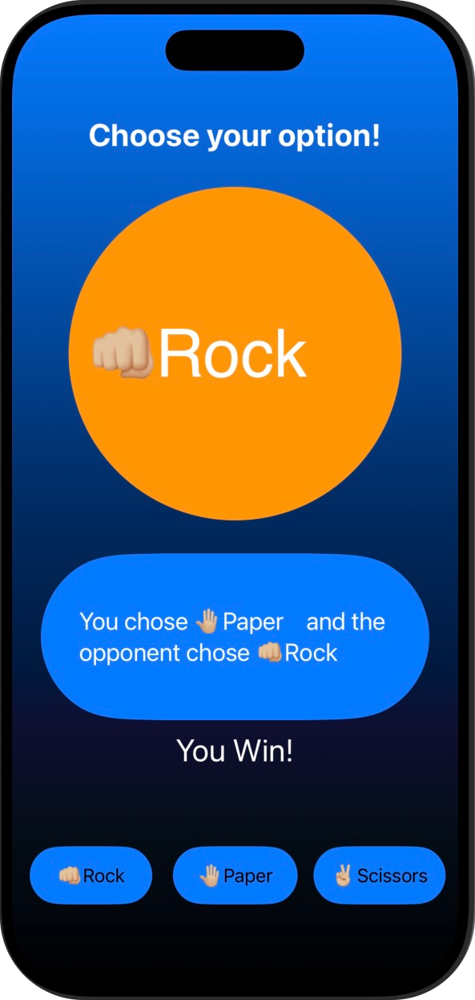
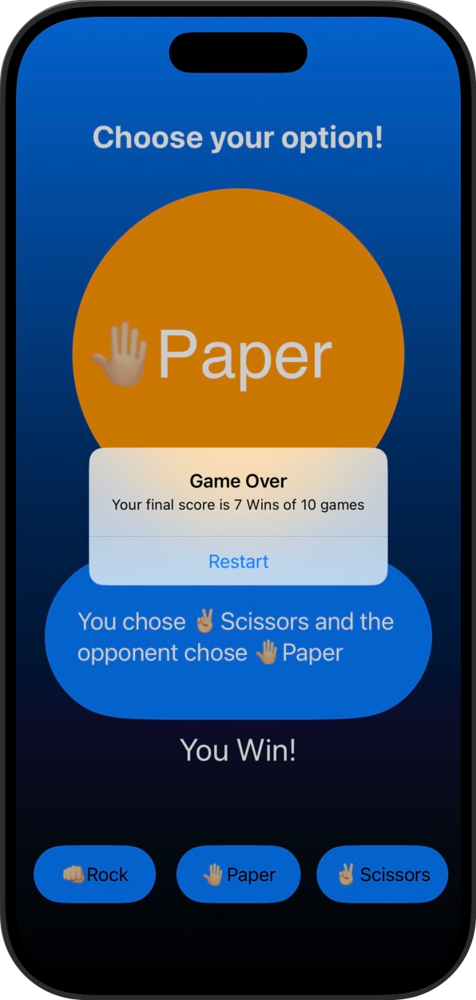

# Milestone 1 (Piedra, Papel o Tijeras)

Primer reto que reune los conocimientos adquiridos hasta ahora

## 📱 Funcionalidades
➡️ Juego de desafío Piedra, Papel o Tijeras.  
“Piedra, papel o tijeras” es un clásico juego de azar y estrategia en el que dos jugadores eligen simultáneamente entre tres opciones: piedra, papel o tijeras. La piedra gana contra las tijeras, las tijeras ganan contra el papel y el papel gana contra la piedra. En esta versión digital del juego, el usuario deberá elegir sabiamente para vencer la inteligencia de la app.

## 🎯 Reto
➡️ En cada uno de las mini aplicaciones de este programa hay unos retos adidionales para que la persona que lo esté realizando amplíe un poco el contenido de la misma.  

✏️ Las modificaciones en este caso son las siguientes:  

1️⃣ En cada turno, la aplicación elegirá al azar piedra, papel o tijera.  
2️⃣ En cada turno, la aplicación alternará entre indicar al jugador si gana o pierde.  
3️⃣ El jugador debe pulsar la jugada correcta para ganar o perder.  
4️⃣ Si acierta, gana un punto; de lo contrario, pierde un punto.  
5️⃣ El juego termina después de 10 preguntas, momento en el que se muestra la puntuación.  

Y el resultado: ⬇️

  
  &nbsp;&nbsp;&nbsp;&nbsp;&nbsp;&nbsp;&nbsp;&nbsp;&nbsp;
  
  

## 📌 Créditos
‼️ Este proyecto es parte del programa [100 días de SwiftUI](https://www.hackingwithswift.com/100/swiftui) de Paul Hudson, en la plataforma [Hacking with Swift](https://www.hackingwithswift.com) ‼️