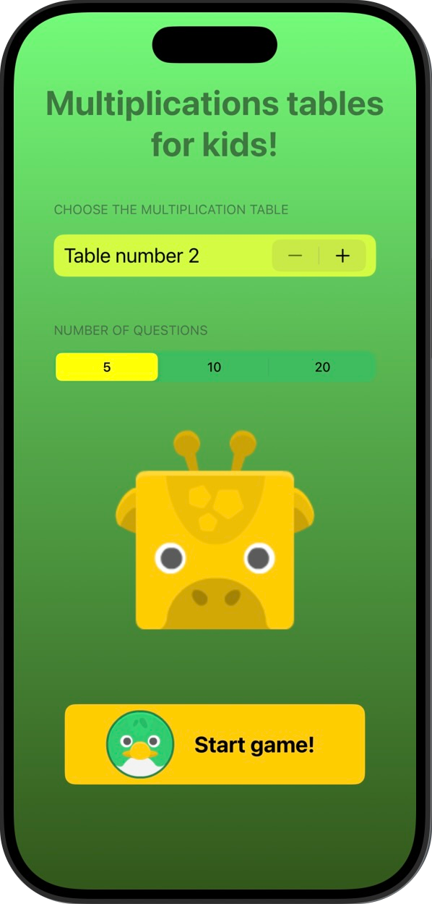
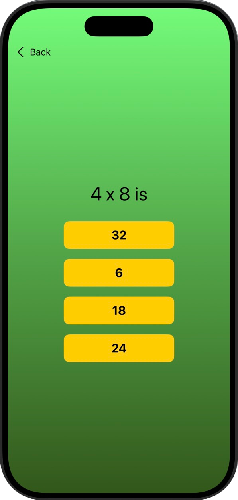
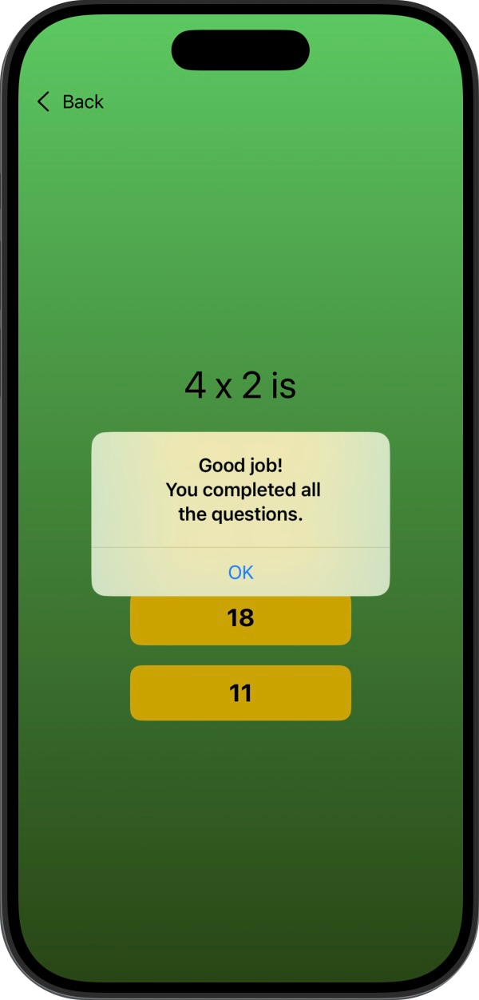

# Milestone 2 (Tabla de multiplicar)

Segundo reto que reune los conocimientos adquiridos hasta ahora

## 📱 Funcionalidades
➡️ Aplicación educativa para que los más peques practiquen las tablas de multiplicar.  
1️⃣ El usuario podrá elegir la tabla de multiplicar que quiera desde el número 2 hasta el 12.  
2️⃣ El usuario podrá elegir cuántas preguntas quiere responder, 5, 10 o 20.  
3️⃣ Las preguntas no serán secuencuales, si no que se generarán de forma aleatoria.  
4️⃣ Si falla una respuesta, recibirá un aviso y podrá intentarlo de nuevo. 

Y el resultado: ⬇️

  
  &nbsp;&nbsp;&nbsp;&nbsp;&nbsp;&nbsp;&nbsp;&nbsp;&nbsp;
  
  &nbsp;&nbsp;&nbsp;&nbsp;&nbsp;&nbsp;&nbsp;&nbsp;&nbsp;
  
  

## 📌 Créditos
‼️ Este proyecto es parte del programa [100 días de SwiftUI](https://www.hackingwithswift.com/100/swiftui) de Paul Hudson, en la plataforma [Hacking with Swift](https://www.hackingwithswift.com) ‼️