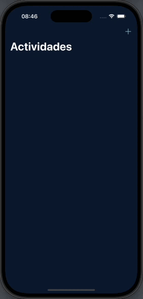

# Milestone 3 (Seguimiento de hábitos)

Tercer reto que reune los conocimientos adquiridos hasta ahora

## 📱 Funcionalidades
➡️ Aplicación de seguimiento de hábitos para quienes desean controlar cuánto hacen ciertas cosas, como aprender un idioma, tocar un instrumento, hacer ejercicio, etc.  
1️⃣ El usuario podrá decidir qué hábito quiere registrar. Se quedará registrado en la pantalla principal. 
2️⃣ El hábito constará de un título y un descripción.  
3️⃣ Al seleccionar un hábito ya registrado, llevará al usuario a otra pantalla donde mostrará el título y la descripción del mismo, además de un botón que podrá incrementar el número de finalizaciones.  

Y el resultado: ⬇️

  
  

## 📌 Créditos
‼️ Este proyecto es parte del programa [100 días de SwiftUI](https://www.hackingwithswift.com/100/swiftui) de Paul Hudson, en la plataforma [Hacking with Swift](https://www.hackingwithswift.com) ‼️